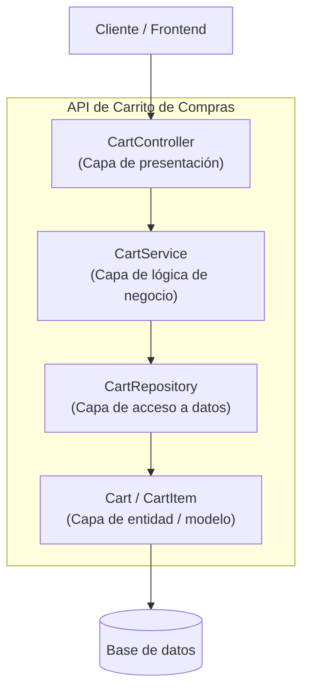

# Actividad Semana 6 — Arquitectura en capas de una API

**Asignatura:** Desarrollo Fullstack
**Caso elegido:** API de gestión de carrito de compras (CartService)

---

## 1. Diagrama de capas

**Flujo:** Cliente → Controller → Service → Repository → Entity → Base de datos (y la respuesta regresa por el mismo camino, en sentido inverso).

---

## 2. Responsabilidad de cada capa

| Capa | Responsabilidad |
|---|---|
| **Controller** | Recibe las peticiones HTTP (rutas del carrito), valida el formato de entrada (JSON, parámetros de la URL), y devuelve la respuesta con el código de estado adecuado. No contiene lógica de negocio, solo traduce HTTP ↔ Service. |
| **Service** | Contiene la lógica de negocio: calcular totales, aplicar descuentos, validar que el producto tenga stock, verificar reglas como "un carrito no puede tener cantidad negativa". Orquesta llamadas al Repository. No sabe nada de HTTP ni de SQL. |
| **Repository** | Se encarga del acceso a datos: consultas, inserciones, actualizaciones y eliminaciones sobre la tabla/colección de carritos e items. Abstrae el motor de persistencia (SQL, MongoDB, etc.) para que el Service no dependa de él directamente. |
| **Entity** | Representa el modelo de datos (`Cart`, `CartItem`): sus atributos (id, producto, cantidad, precio unitario) y las relaciones entre ellos. Es el objeto que finalmente se guarda o se lee de la base de datos. |

---

## 3. Endpoint de ejemplo

**`POST /api/cart/{cartId}/items`** — Agregar un producto al carrito

**Flujo por capas:**

1. **Controller** (`CartController.addItem`): recibe la petición POST con `cartId` en la URL y `{productId, quantity}` en el body. Valida que el body tenga los campos requeridos.
2. **Service** (`CartService.addItemToCart`): verifica que el producto exista y tenga stock disponible, calcula el subtotal (`precio × cantidad`), y aplica reglas de negocio (por ejemplo, límite máximo de unidades por producto).
3. **Repository** (`CartRepository.save`): persiste el nuevo `CartItem` asociado al `Cart`, o actualiza la cantidad si el producto ya estaba en el carrito.
4. **Entity** (`Cart`, `CartItem`): representa el estado actualizado del carrito que finalmente queda guardado en la base de datos.

**Respuesta:** el Controller devuelve `201 Created` con el carrito actualizado (total, lista de items) en formato JSON.

---

## Justificación de la separación en capas

Separar la API de esta forma permite:
- Cambiar la base de datos sin tocar la lógica de negocio (solo se modifica el Repository).
- Probar el Service de forma aislada (unit tests) sin necesidad de un servidor HTTP.
- Reutilizar el Service desde otro punto de entrada (por ejemplo, un job programado) sin duplicar lógica.
